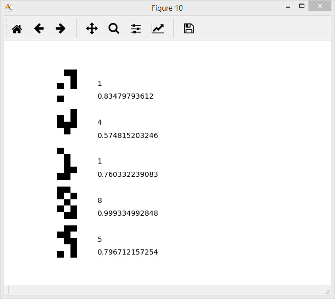

# Simple Neuron Network for symbol classification

 Simple Neuron Network for small images with nine digits and a zero

    Neorn Network has 2 hiden layers, and studying on the 5000 iterations 
    Training set - 100 images 5x3 pixels (with some defects)
       Test set - 5 artificially-generated images 5x3 pixels 
    Output: 5 generated images and prediction rate on the plot

 
  

