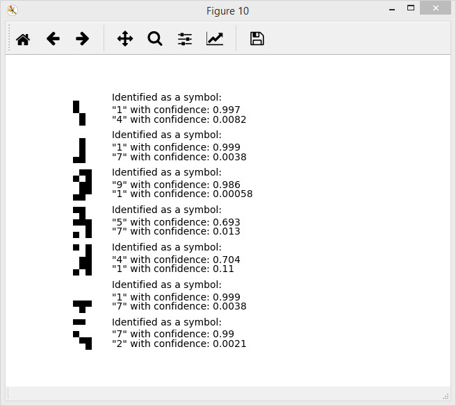

# Simple Neuron Network for symbol classification

 Simple Neuron Network for small images with nine digits and a zero

  			Network has 2 hiden layers. Studying on the 5000 iterations 
   	Training set - 100 images 5x3 pixels (with some defects)
  			Test set - 5 or 7 artificially-generated images 5x3 pixels 
    	Output: 5 or 7 generated images and prediction rate on the plot

 
  
  

